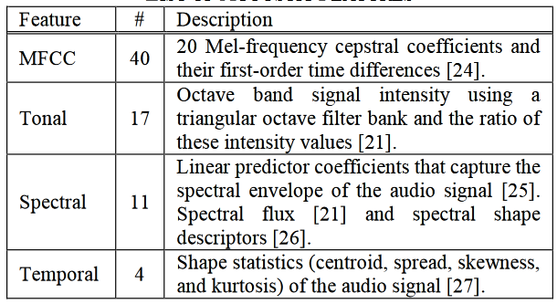

# Secondary Databases
|Index|Database|Stim. Type|Stim. Dur.|Stim. Dur. Unit|Stim. N|Feature N.|Ppt. N|Ppt. Expertise|Ppt. Origin|Ppt. Sampling|Ppt. Task|Feature Source|Feature Categories
|-|-|-|-|-|-|-|-|-|-|-|-|-|-|
1|EMOPIA|Piano Solo (pop music)|30 to 40|s|387|24 (average of 20 MFCC + note length, velocity, beat note density, key)|4 total, 1 per song (annotators, not ppts)|not specified|not specified|presumably researchers|classify|MIDI Toolbox|Rhythm, Harmony, Timbre
2|AMG1608|pop|30|s|1608 |72|665|no restrictions|MTurk|crowdsource|rate|MIRToolbox, YAAFE|Timbre, tonal, spectral, temporal
3|NTUMIR|Famous pop songs|25|s|60|46|99 (40 annotations per clip)|no restrictions|campus|convenience|rate|MIRToolbox, Sound Description Toolbox, MA Toolbox|Melody/harmony, spectral, temporal, rhythmic, lyrics|
4|DEAM|pop|58 full-length and 1744 45-second excerpts|s|1802|261|2013-14: 10; 2015: 5 MTurk workers|no restrictions|2013-14: MTurk; 2015: MTurk and Lab workers|crowdsourcing, convenience|rate|OpenSMILE|Pitch, Timbre, Voice, Dynamic. Many MFCC features
5|MediaEval2013/emoMusic/1000 songs|western pop of various genres|45|s|744|6670|300 workers + |Nonexperts (Mturk) + experts|MTurk|Crowdsourcing, presumed convenience for experts|Rate|OpenSMILE|Pitch, Timbre, Voice, Dynamic. Many MFCC features|
6|Soundtracks|obscure film soundtracks|5|s|110|none?|116 university students|nonmusicians|campus|Convenience|rate, classify|NA|NA|
7|PSIC3839|Chinese popular|full? 180 s excerpts extracted for analyses|s|3839|ns. About 10 feature categories. Unclear dimensionaltiy|87|no restrictions|campus|convenience|rate|Librosa|Pitch, Timbre, Harmony, Rhythm|
8|CH818|Chinese pop|30|s|818|15|3|experts|China|Convenience|Rate|MIRToolbox, PsySound, ChromaToolbox,Tempogram Toolbox|Dynamic, Pitch, Rhythm, Timbre, Harmony|
9|Zhang, Huang, Yang, & Xu (2015) |Chinese pop|30|s|171|84 (dimensionality)|10|Nonexperts|not specified|not specified|classify|MAToolbox, MIRToolbox, Coversongs|Dynamics, Timbre, Rhythm|

--------

[comment]: # (|MSD|pop|full [or 30s]|s|1000000|54? [table 2]|none|NA|NA|NA|NA|EchoNest|**13**)

