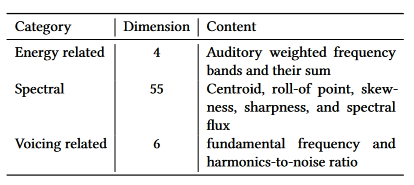

# Secondary Databases
|Index|Database|Stim. Type|Stim. Dur.|Stim. Dur. Unit|Stim. N|Feature N.|Ppt. N|Ppt. Expertise|Ppt. Origin|Ppt. Sampling|Ppt. Task|Feature Source|Feature Categories|Citation
|-|-|-|-|-|-|-|-|-|-|-|-|-|-|-|
1|**EMOPIA**|Piano Solo (pop music)|30 to 40|s|387|24 (average of 20 MFCC + note length, velocity, beat note density, key)|4 total, 1 per song (annotators, not ppts)|not specified|not specified|presumably researchers|classify|MIDI Toolbox|Rhythm, Harmony, Timbre|[Hung et al. (2021)](https://annahung31.github.io/EMOPIA/)
2|**AMG1608**|pop|30|s|1608 |72|643 MTurk, 22 Taiwan subjects|no restrictions|MTurk|crowdsource|rate|MIRToolbox, YAAFE|Timbre, tonal, spectral, temporal|[Chen et al. (2015)](http://amg1608.blogspot.com/2015/02/the-amg1608-dataset-for-music-emotion.html)
3|**NTUMIR**|Famous pop songs|25|s|60|46|99 (40 annotations per clip)|no restrictions|campus|convenience|rate|MIRToolbox, Sound Description Toolbox, MA Toolbox|Melody/harmony, spectral, temporal, rhythmic, lyrics|Yang et al. (2011)* 
4|**DEAM**|pop|58 full-length and 1744 45-second excerpts|s|1802|261|Total n not specified. Minimum annotations per piece: 2013-14: 10; 2015: 5 MTurk workers|no restrictions|2013-14: MTurk; 2015: MTurk and Lab workers|crowdsourcing, convenience|rate|OpenSMILE|Pitch, Timbre, Voice, Dynamic. Many MFCC features|[Aljanaki et al. (2017)](https://cvml.unige.ch/databases/DEAM/)
5|**MediaEval2013/emoMusic/1000 songs**|western pop of various genres|45|s|744|6670|300 workers + |Nonexperts (Mturk) + experts|MTurk|Crowdsourcing, presumed convenience for experts|Rate|OpenSMILE|Pitch, Timbre, Voice, Dynamic. Many MFCC features|[Soleymani et al. (2013)](https://cvml.unige.ch/databases/emoMusic/)
6|**Soundtracks**|obscure film soundtracks|5|s|110|none?|116 university students|nonmusicians|campus|Convenience|rate, classify|NA|NA|[Eerola & Vuoskoski (2011)](https://osf.io/p6vkg/wiki/home/)
7|**PSIC3839**|Chinese popular|full? 180 s excerpts extracted for analyses|s|3839|ns. About 10 feature categories. Unclear dimensionaltiy|87|no restrictions|campus|convenience|rate|Librosa|Pitch, Timbre, Harmony, Rhythm|[Liang et al. (2022)](https://github.com/xl2218066/PSIC3839)
8|**CH818**|Chinese pop|30|s|818|15|3|experts|China|Convenience|Rate|MIRToolbox, PsySound, ChromaToolbox,Tempogram Toolbox|Dynamic, Pitch, Rhythm, Timbre, Harmony|Hu & Yang (2017)
9|**Zhang, Huang, Yang, & Xu (2015)**|Chinese pop|30|s|171|84 (dimensionality)|10|Nonexperts|not specified|not specified|classify|MAToolbox, MIRToolbox, Coversongs|Dynamics, Timbre, Rhythm|Zhang et al. 2015
10|**PMEmo**|choruses of top pop songs|variable|s|794|65 (260 dims)|457|366 Chinese university students (44 music majors); 47 English speakers|campus|convenience|rate|ComParE 2013 baseline feature set|Dynamic, Timbre, Pitch (tabulated as energy-related, spectral, voicing related)|[Zhang et al. (2018)](https://github.com/HuiZhangDB/PMEmo?tab=readme-ov-file)
11|**NJU-V1**|Music clips (limited detail)|variable|s|777|Lyric (BoW; 50 dims before filtering), MFCC, spectral contrast, chromagram|NA (lastfm tags)|NA|LastFM|crowdsource (webscraping)|NA|NA|Lyric, Timbre, Harmony|[Xue et al. (2015)](https://cs.nju.edu.cn/sufeng/data/musicmood.htm)
12|**ISMIR-2012**|popular|30 or 60|s|2904|54 (means + sds)|NA (lastfm tags)|NA|LastFM|crowdsource (webscraping)|NA|MIRToolbox|Dynamics, Rhythm, Timbre (they call this Spectral), Harmony|[Song et al. 2012](http://yadingsong.blogspot.com/2015/03/popular-music-emotion-dataset-ismir2012.html)**|

\* Dataset not available online

\** Only lyrics & timestamps included in public dataset 

# References

> Aljanaki, A., Yang, Y. H., & Soleymani, M. (2017). Developing a benchmark for emotional analysis of music. PloS one, 12(3), e0173392.

> Chen, Y. A., Yang, Y. H., Wang, J. C., & Chen, H. (2015, April). The AMG1608 dataset for music emotion recognition. In 2015 IEEE international conference on acoustics, speech and signal processing (ICASSP) (pp. 693-697). IEEE.

> Eerola, T. & Vuoskoski, J. K. (2011). A comparison of the discrete and dimensional models of emotion in music. Psychology of Music, 39(1), 18-49. https://doi.org/10.1177/0305735610362821

>Hu, X., & Yang, Y. H. (2017). The mood of Chinese Pop music: Representation and recognition. Journal of the Association for Information Science and Technology, 68(8), 1899-1910.

> Hung, H. T., Ching, J., Doh, S., Kim, N., Nam, J., & Yang, Y. H. (2021). EMOPIA: A multi-modal pop piano dataset for emotion recognition and emotion-based music generation. arXiv preprint arXiv:2108.01374.

> Soleymani, M., Caro, M. N., Schmidt, E. M., Sha, C. Y., & Yang, Y. H. (2013, October). 1000 songs for emotional analysis of music. In Proceedings of the 2nd ACM international workshop on Crowdsourcing for multimedia (pp. 1-6).

>Xu, L., Yun, Z., Sun, Z., Wen, X., Qin, X., & Qian, X. (2022). PSIC3839: Predicting the Overall Emotion and Depth of Entire Songs. In Design Studies and Intelligence Engineering (pp. 1-9). IOS Press.

>Xue, H., Xue, L., & Su, F. (2015). Multimodal music mood classification by fusion of audio and lyrics. In MultiMedia Modeling: 21st International Conference, MMM 2015, Sydney, NSW, Australia, January 5-7, 2015, Proceedings, Part II 21 (pp. 26-37). Springer International Publishing.

>Zhang, J. L., Huang, X. L., Yang, L. F., Xu, Y., & Sun, S. T. (2017). Feature selection and feature learning in arousal dimension of music emotion by using shrinkage methods. Multimedia systems, 23, 251-264.

>Zhang, K., Zhang, H., Li, S., Yang, C., & Sun, L. (2018, June). The PMEmo dataset for music emotion recognition. In Proceedings of the 2018 acm on international conference on multimedia retrieval (pp. 135-142).

>Song, Y., Dixon, S., & Pearce, M. T. (2012, October). Evaluation of musical features for emotion classification. In ISMIR (pp. 523-528).

[comment]: # (|MSD|pop|full [or 30s]|s|1000000|54? [table 2]|none|NA|NA|NA|NA|EchoNest|**13**)